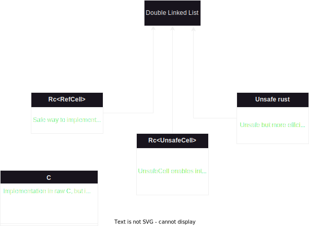

# Double Linked List

The motivation behind the choise of Doulbe Linked List (DLL) is in learning about memory management in Rust.
The DLL itself is quite rarely used data structure due to its performance.
We tried to implement this data structure in different ways to get practical skills with memory in Rust.

# Detailed requirements
- Implement DLL in different ways in Rust (+)
- Implement DLL in C (+, but without generics)
- Test the implementations (+)
- Benchmark the implementations (-)

# Design choices
There were not so many design choices cause the domain is very straightforward. We were only searching for different ways to implement the data structure. 
All variants we have found - we implement.
Maybe one of the design choices was to return a reference to value instead of returning the value itself in `get()` method
It was decided in this way due to possible pitfalls with copying the value. That's why the method `remove()` not only removes the value but also return is.

# Dependencies 
The only dependency we have used is the `rs_test`
It help us with macros that reduced the amount of repetitive code in tests.

# Evaluation
Mykhailo Sichkaruk:
From my point of view the good part is that the code works and tests passed). It was an interesting experience similar to the solution of puzzles. 
The bad part is that I didn't write an Iterator and Double Ended Iterator for the DLL due to its complexity and time constraints.
Compared to other language Rust code writes longer, but the positive part is the safe code. I am sure that my code (Rc<RefCell>) won't behave unexpectedly, and even if something goes wrong - panic will show what and where it went wrong 
